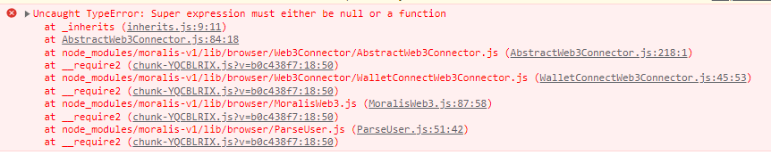

# test-moralis-vite-reactjs-typescript
Note : This project is for test propoouses to check the connection with moralis self hosted [ backend connection ]

# Testing with

```
node version => v19.9.0
npm version => 9.6.3
```

# Instalation
```shell
npm install
```

# Run the project
```shell
npm run dev
```

# Env configuration
Change the file `.example.env` to `.env` and configure with your backend

# Notes
I follow the instalation process using the documetation from `react-moralis` => link => 
using the next commands
```
npm install react react-dom moralis-v1 react-moralis
```

# Output on installation
```shell
myuser@:~/pat/to/the/project/$ npm install
npm WARN ERESOLVE overriding peer dependency
npm WARN While resolving: use-immer@0.6.0
npm WARN Found: react@18.2.0
npm WARN node_modules/react
npm WARN   react@"^18.2.0" from the root project
npm WARN   2 more (react-dom, react-moralis)
npm WARN 
npm WARN Could not resolve dependency:
npm WARN peer react@"^16.8.0 || ^17.0.1" from use-immer@0.6.0
npm WARN node_modules/react-moralis/node_modules/use-immer
npm WARN   use-immer@"^0.6.0" from react-moralis@1.4.2
npm WARN   node_modules/react-moralis
npm WARN 
npm WARN Conflicting peer dependency: react@17.0.2
npm WARN node_modules/react
npm WARN   peer react@"^16.8.0 || ^17.0.1" from use-immer@0.6.0
npm WARN   node_modules/react-moralis/node_modules/use-immer
npm WARN     use-immer@"^0.6.0" from react-moralis@1.4.2
npm WARN     node_modules/react-moralis
```

# Error that comes
